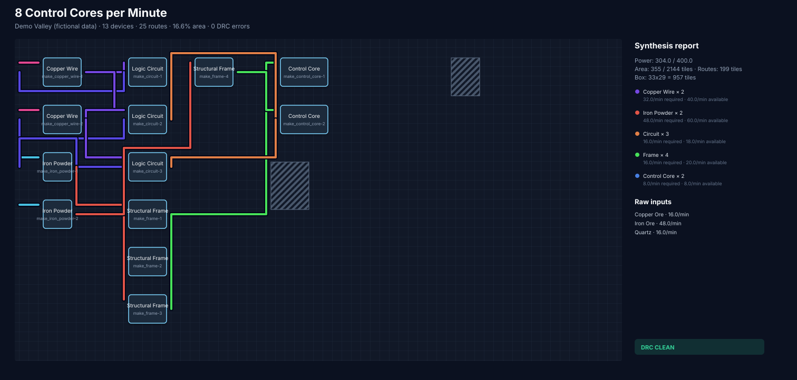
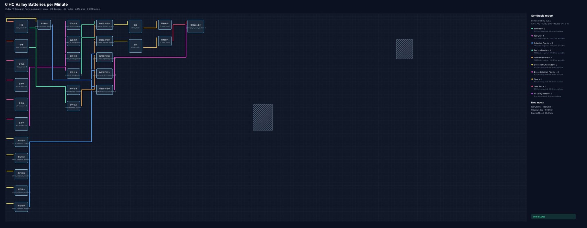

# Endfield Factory Compiler

[简体中文](README.zh-CN.md)

[](https://github.com/xianyuekz/endfield-factory-compiler/actions/workflows/ci.yml)
[](https://github.com/xianyuekz/endfield-factory-compiler/stargazers)

> An experimental, offline EDA pipeline for factory planning: recipe
> synthesis, technology mapping, placement, logistics routing and DRC.




This repository is a small, working proof of concept—not a promise to build a
full game tool. It explores what happens when factory planning is treated like
FPGA physical design:

```text
production targets
  -> recipe synthesis
  -> region technology mapping
  -> device placement
  -> congestion-aware A* logistics routing
  -> design-rule checks
  -> SVG + JSON + Markdown report
```

The toy demo compiles a target of 8 control cores per minute into 13 devices
and 25 routes with a clean DRC report. The repository also includes a first
research fixture for a real-looking Endfield target: 6 HC Valley Batteries per
minute, compiled into an inspectable placement/routing plan.

Official game data and blueprint strings are not redistributed here. Real-ish
examples are marked as community-data research fixtures rather than
authoritative exports.

## Try it

Requirements: Python 3.11 or newer. There are no runtime dependencies.

```bash
python -m venv .venv
# Windows: .venv\Scripts\activate
# Linux/macOS: source .venv/bin/activate
python -m pip install -e .

efc validate-pack region-packs/demo-valley/region.json
efc validate-project examples/control-core.json
efc compile examples/control-core.json --out build/demo

efc validate-pack region-packs/valley-iv-research/region.json
efc validate-project examples/hc-valley-battery.json
efc compile examples/hc-valley-battery.json --out build/hc-valley-battery
```

Open `build/demo/layout.svg` in a browser. The machine-readable physical plan
is written to `build/demo/plan.json`, and an explainable build report is
written to `build/demo/report.md`.

Run the test suite with:

```bash
python -m unittest discover -s tests -v
```

## Why region packs?

Maps, devices, recipes, footprints and logistics rules can vary by area and
game update. The compiler core therefore knows no official game data. A
versioned region pack supplies the "device support" layer, similar to installing
an FPGA family in Quartus.

See [the region-pack format](docs/REGION_PACKS.md) and the fictional
[`demo-valley`](region-packs/demo-valley/region.json) pack.

Projects may also set hard limits for power, device count and unique logistics
tiles. See [the project format](docs/PROJECTS.md).

The first non-toy example is documented in
[HC Valley Battery](docs/HC_VALLEY_BATTERY.md). It currently emits an SVG,
JSON physical plan and Markdown report; official in-game blueprint-code export
is intentionally left behind an adapter boundary until the format is documented
and permitted to support.

## Current scope

Implemented:

- DAG recipe expansion and machine-count calculation
- power-budget calculation
- data-driven devices, recipes, grid obstacles and logistics capabilities
- deterministic column placement with obstacle avoidance
- congestion-aware A* routing with crossing and bend costs
- capacity-aware many-to-many flow allocation between physical devices
- DRC for bounds, overlap, power, per-device flow, route capacity and connectivity
- project-level power, device-count and route-tile constraints
- physical metrics for footprint, utilization, route length, bends and crossings
- JSON Schema files for editor validation and autocomplete
- replaceable routing backends with CPU, search and timeout telemetry
- standalone Rust route-core prototype for native A* hot-loop work
- community-data HC Valley Battery research example
- dependency-free JSON, SVG and Markdown output

Deliberately not implemented:

- official Endfield blueprint-code import or export
- extracted or copyrighted game assets
- alternate recipes, by-products, fluids or cyclic production graphs
- global-optimal placement and negotiated-congestion routing
- GUI, account system or online backend

These boundaries keep the seed project understandable and safe to fork.

## Project status

Experimental and community-maintained. Feature proposals, region-pack data and
alternative placement/routing backends are welcome. Response times are not
guaranteed, and new maintainers are explicitly welcome.

Read [the architecture](docs/ARCHITECTURE.md) and
[contribution guide](CONTRIBUTING.md) before starting a larger change.
Release changes are recorded in the [changelog](CHANGELOG.md).
Known correctness gaps are ordered in the [roadmap](docs/ROADMAP.md).
Engineering checks are listed in [quality gates](docs/QUALITY.md), and larger
technical choices are recorded as [architecture decisions](docs/adr).

## Performance contract

Backends receive one shared execution budget:

```bash
efc compile examples/control-core.json --out build/demo \
  --jobs 8 --seed 0 --time-limit 30
```

The current compact A* backend remains deterministic and serial. When more than
one job is requested it reports `1/N effective/requested` and emits a DRC
warning. Python is the CLI and data orchestration layer; performance-critical
hot loops are expected to move into native backends as they mature. See
[performance and parallelism](docs/PERFORMANCE.md) and the reproducible
[`compile_scaling.py`](benchmarks/compile_scaling.py) benchmark.

The first native kernel lives in [`native/route_core`](native/route_core). It
is tested in CI but not required to install the Python CLI yet.

## Disclaimer

This is an unofficial fan-made technical experiment. It is not affiliated with
or endorsed by Hypergryph, Gryphline, or the developers and publishers of
Arknights: Endfield. All trademarks belong to their respective owners.

Licensed under the [MIT License](LICENSE).
